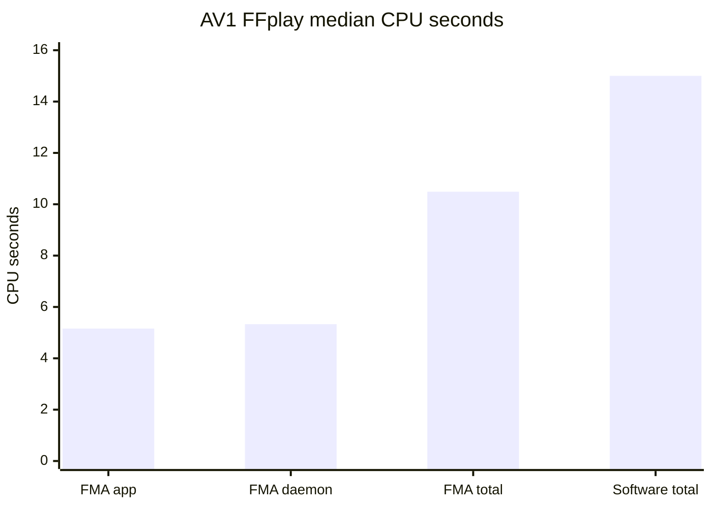

# Application compatibility

Codec probes establish correctness before a desktop application is involved.
The application stage then measures the complete path: application decode,
Android daemon work, VA surface presentation, the Linux graphics stack and
Termux:X11.

## VLC

VLC 3.0.16 can use FMA for H.264 through its normal FFmpeg VA-API decoder. Its
OpenGL video output also needs an EGL implementation that advertises
`EGL_EXT_image_dma_buf_import`. If the desktop session uses a different EGL
stack, VLC may reject `glconv_vaapi_x11`, probe inaccessible `/dev/dri` nodes
and fall back to software decoding even though `vainfo` succeeds.

Run VLC with the same Mesa environment used by the accelerated desktop, plus
the FMA variables from [the setup guide](setup-proot.md):

```bash
export LD_LIBRARY_PATH=/path/to/mesa/lib
export LIBGL_DRIVERS_PATH=/path/to/mesa/lib/dri
export MESA_LOADER_DRIVER_OVERRIDE=panfrost
vlc --avcodec-hw=vaapi video.mp4
```

Use the bounded benchmark instead of repeatedly driving VLC by hand:

```bash
FMA_DAEMON_PID="$(pgrep -f '/fake-media-acceld ' | head -n 1)" \
FMA_APP_USER=linux-user \
tools/fma-vlc-benchmark.sh video.mp4 both
```

Set `FMA_RUNS=3` for counterbalanced repetitions. Odd runs execute hardware
first; even runs execute software first, reducing order and thermal bias.

The report separates application CPU from daemon CPU, counts late and dropped
frames, and verifies both the VA decoder and VA/EGL conversion-module choices.
Logs remain in the printed temporary directory for diagnosis. The helper sends
SIGTERM and then SIGKILL to the whole application process group if playback
does not finish within the media duration plus a bounded grace period.

## H.264 real-world checkpoint

The local test source is a user-supplied 2K Gravity trailer; it is not included
in this repository. The repeatable smoke segment starts near 60 seconds and
retains the original H.264 bitstream.

| Property | Value |
| --- | ---: |
| Profile and level | High, level 4.0 |
| Visible size | 2048 x 858 |
| Displayed frames | 358 |
| Smoke duration | 15.099 s |
| Smoke-file MD5 | `475511c8d3ca9673c7ddb46c9f0d5a91` |
| Decoded NV12 MD5 | `b2ad26f06168a107e8d3647ec37d6cb8` |

Hardware and software decoding produced byte-identical NV12. A real-time VLC
comparison on a Pixel 6a produced:

| Measurement | FMA hardware | Software |
| --- | ---: | ---: |
| Wall time | 16.525 s | 16.586 s |
| VLC and presentation CPU | 6.822 s | 53.690 s |
| Android daemon CPU | 2.320 s | 0 s |
| Total measured CPU | **9.142 s** | **53.690 s** |
| Peak application RSS | 101 MiB | 209 MiB |
| Late-display warnings | 2 | 4 |
| Decoder frame drops | 0 | 0 |

All 358 hardware frames used direct DMA-BUF-backed VA surfaces. No decoded
frame data crossed the Unix socket, and the VA driver performed no second
presentation copy. This reduced total CPU by about 83 percent while preserving
real-time pacing.

## VP9 real-world checkpoint

A Profile 0 WebM smoke stream was generated from the same local Gravity segment
at its original 2048 x 858 resolution. It contains 358 frames, lasts 15.015
seconds and has file MD5 `0751680aa8d6a58bec880f359caf9eac`. Hardware and
software decoding produced the same visible NV12 MD5,
`6da6806f19b738f92a01ef10540012fc`.

| Measurement | FMA hardware | Software |
| --- | ---: | ---: |
| Decode-throughput CPU | 3.253 s | 11.739 s |
| Decode-throughput wall time | 3.344 s | 3.551 s |
| Median VLC wall time | 15.896 s | 16.109 s |
| Median VLC and presentation CPU | 6.436 s | 24.014 s |
| Median Android daemon CPU | 3.030 s | 0 s |
| Median total measured VLC CPU | **9.466 s** | **24.014 s** |
| Median peak application RSS | 72 MiB | 136 MiB |
| Late-display warnings | 0 | 0 |
| Decoder frame drops | 0 | 0 |

These are medians from three counterbalanced runs. Hardware wall time ranged
from 15.824 to 16.069 seconds; software ranged from 16.078 to 16.210 seconds.
All 358 VP9 surfaces in every hardware run were direct and exact. Median total
CPU fell by about 61 percent. Median VA context creation took 85 ms and drain
plus destruction took 15 ms, ruling out lifecycle setup as a pacing bottleneck.

## AV1 FFplay checkpoint

FFplay at FFmpeg commit `5c395992f99feb47860e4cc99a0cea2009457870`
was built with both patches from [`patches/ffmpeg`](../patches/ffmpeg). The
packet-preserving adapter supplies complete AV1 temporal units to FMA, while
the FFplay patch permits explicit VA-API decode with filtered SDL output when
FFplay's Vulkan renderer is unavailable.

Use the same counterbalanced process accounting as the VLC probe:

```bash
FMA_FFPLAY=/path/to/patched/ffplay \
FMA_SOFTWARE_FFPLAY=/usr/bin/ffplay \
FMA_DAEMON_PID="$(pgrep -f '/fake-media-acceld ' | head -n 1)" \
FMA_APP_USER=linux-user \
FMA_RUNS=3 \
tools/fma-ffplay-benchmark.sh video.ivf both
```

The real-world smoke is a Main-profile, 8-bit AV1 transcode of the same local
Gravity segment used by the H.264 and VP9 checkpoints. It contains 360 frames,
lasts 15.015 seconds, has file MD5
`61fb98b6a86d948e8d9b15dfc81a5192`, and preserves the 2048 x 858 visible
size. Hardware and software decoding produced exactly the same 948,879,360
visible NV12 bytes.

The following hot-device checkpoint started at Android thermal status 2 and
ended at status 3. Values are medians from three counterbalanced runs, so they
measure the current implementation under sustained pressure rather than a
cold-device peak:

| Measurement | FMA hardware | Software |
| --- | ---: | ---: |
| Wall time | 16.119 s | 16.881 s |
| FFplay and presentation CPU | 5.158 s | 15.001 s |
| Android daemon CPU | 5.330 s | 0 s |
| Total measured CPU | **10.488 s** | **15.001 s** |
| Peak application RSS | 60.8 MiB | 135.5 MiB |
| FFplay presentation drops | 6 | 1 |



All 360 decoded outputs were stored directly in DMA-BUF-backed surfaces, with
no decoded-frame data crossing the Unix socket and no daemon-side storage
copy. FFplay currently downloads about 895 MiB of planar image data per run for
SDL presentation. That compatibility copy took under 0.52 seconds in the VA
driver, but its subsequent upload and display remain outside FMA. The selected
SDL/OpenGL renderer is therefore part of the application environment, not a
Mali or Panfork dependency of FMA.

## Playback lifecycle checkpoint

The lifecycle probe drives the actual FFplay SDL window rather than restarting
the decoder for each operation:

```bash
FMA_FFPLAY=/path/to/patched/ffplay \
tools/fma-ffplay-lifecycle.sh video.mp4 hardware
```

It waits for the X11 window, pauses playback, verifies that the media clock is
held, resumes and verifies clock advancement, then sends an in-process
ten-second seek. The bounded process-group runner prevents a failed player from
remaining in the background. `xdotool` is required only by this test probe.

| Codec | Pause | Resume | In-process seek | VA context reuse |
| --- | --- | --- | --- | --- |
| H.264 High | Passed | Passed | Passed | One context |
| VP9 Profile 0 | Passed | Passed | Passed | One context |
| AV1 Main | Passed | Passed | Passed after sequence-redelivery fix | One context |

The software AV1 control completed the same raw-IVF seek while the first FMA
attempt stopped after 107 of 360 frames. FFmpeg calls the AV1 hardware
accelerator's flush callback during a seek, but the initial FMA adapter did not
mark its cached sequence header for redelivery. Resetting that state on flush
made the next AV1 packet carry the sequence header again; the hardware run then
reached the end in the same VA context. FFplay's `fd` counter includes frames
intentionally skipped by this seek, so it is not treated as a performance-drop
measurement in this probe.

## Remaining application work

- Connect the packet-preserving AV1 adapter to additional applications that
  embed libavcodec. VLC 3.0's bundled decoder does not provide FMA's AV1 packet
  contract.
- Add browser/RDD-sandbox socket and DMA-heap access without weakening unrelated
  browser sandboxes.
- Validate seek, pause/resume, resolution changes and longer playback soaks.
