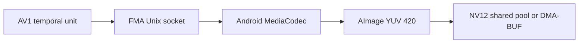

# AV1 decode checkpoint

FMA accepts AV1 Main-profile, 8-bit, 4:2:0 frames from low-overhead IVF and
passes each complete temporal unit to Android MediaCodec. Decoded visible
frames are returned as NV12 through the shared frame pool or a registered
DMA-BUF output surface.



## Completion contract

The direct AV1 codec checkpoint covers:

- Main profile, 8-bit, 4:2:0 decode;
- low-overhead OBU framing and IVF timestamp conversion;
- all-intra, reference motion vectors, CDF updates and switch frames;
- film grain, non-uniform tiles and short reference signaling;
- dynamic coded-size changes with per-frame visible metadata;
- temporal scalability without spatial layers;
- rejection of malformed OBU framing and unsupported spatial layers;
- explicit rejection when a complete temporal unit exceeds one MediaCodec
  input buffer;
- drain, flush and repeated decode cycles;
- exact visible-frame agreement with FFmpeg software decode;
- bounded input and output waits, with no decoded frames sent over a network
  socket.

The checksum-pinned smoke corpus is derived from FFmpeg's AV1 CBS FATE vectors
and can be prepared with:

```sh
tools/fma-av1-fate-smoke.sh build/fma-ivf-inspect build/av1-fate-smoke
```

| Sample class | IVF packets | Decoded frames | Pixel decode rate | Result |
| --- | ---: | ---: | ---: | --- |
| All-intra | 39 | 39 | 90 fps | exact |
| Size down | 20 | 20 | 160 fps | exact, dynamic size |
| Size up | 20 | 20 | 126 fps | exact, dynamic size |
| CDF update | 2 | 2 | 85 fps | exact |
| Reference MVs | 4 | 4 | 144 fps | exact |
| Motion-field MVs | 4 | 4 | 140 fps | exact |
| Temporal scalability | 8 | 8 | 164 fps | exact |
| Spatial and temporal scalability | 8 | 0 | n/a | rejected |
| Film grain | 10 | 10 | 247 fps | exact |
| Short references | 50 | 50 | 215 fps | exact |
| Non-uniform tiling | 24 | 24 | 293 fps | exact |
| Switch frames | 32 | 32 | 162 fps | exact, dynamic size |

The rates are decode-throughput measurements, not presentation FPS.

## Pixel validation

The Pixel 6a selected `c2.google.av1.decoder`, which Android reports as a
hardware-accelerated component. The exact-output verifier compares FFmpeg
showinfo plane checksums with every returned frame and uses FMA's per-frame
width and height metadata for streams that change dimensions:

```sh
tools/fma-nv12-verify-dynamic.sh INPUT.ivf FMA.nv12 FRAME-INFO.csv
```

Three consecutive all-intra decode/flush cycles produced 117 of 117 frames.
No decoded frame bytes crossed the socket in these probes.

The spatial-and-temporal scalability vector is rejected during OBU preflight.
The Pixel component emits alternating 640x360 and 1280x720 layers for that
stream, while FFmpeg exposes eight 1280x720 display frames. Returning the
component output as if it matched the application's display-frame contract
would therefore corrupt the result. Temporal-only scalability remains enabled
and exact.

A forced 16 KiB MediaCodec input limit rejects an oversized temporal unit
before submission. MediaCodec partial-frame input is retained for H.264 only;
VP9 and AV1 require one complete compressed frame or temporal unit per input
buffer.

## VA-API boundary

The direct codec path is complete, but AV1 is not yet advertised through the
VA-API driver. Standard AV1 VA decode provides picture state and tile payloads,
not the original sequence header and complete low-overhead OBU stream that the
Android component consumes. Supporting it requires a validated AV1 bitstream
reconstructor or a packet-preserving application adapter. FMA does not invent
missing syntax or advertise a profile it cannot reproduce correctly.

This boundary follows libva's AV1 decode structures and FFmpeg's VA-API AV1
adapter. Main-profile 10-bit output is outside this checkpoint because FMA's
current public decoded-frame contract is NV12.
