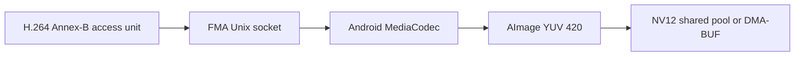
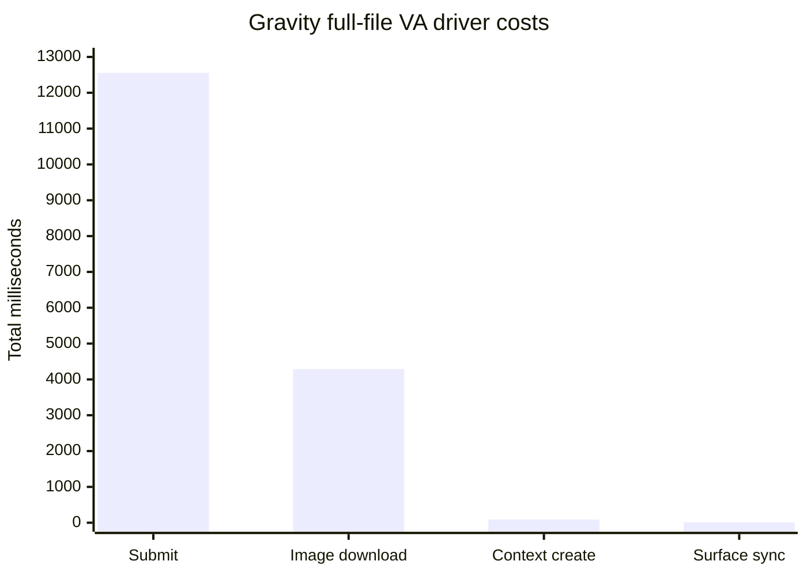

# H.264 decode checkpoint

FMA's packet-preserving H.264 path accepts Annex-B access units and passes them
to Android MediaCodec without reconstructing codec syntax. It targets the
device's 8-bit 4:2:0 AVC decoder and returns visible NV12 frames through shared
memory or a registered DMA-BUF output surface.



## Completion contract

The H.264 codec checkpoint requires all of the following:

- constrained-baseline, main and high profile samples;
- CABAC and CAVLC entropy coding;
- progressive, B-frame and MBAFF/interlaced streams;
- multiple reference pictures and POC type 1 on the packet path;
- streams with and without access-unit delimiters;
- legal header-only end-of-sequence NAL units;
- access units larger than one MediaCodec input buffer;
- drain, flush and repeated decode cycles;
- exact visible-frame agreement with FFmpeg software decode;
- bounded input and output waits, with no compressed frames sent over a
  network socket.

The checksum-pinned FFmpeg FATE smoke corpus is run with:

```sh
tools/fma-h264-fate-smoke.sh build/fma-h264-inspect build/h264-fate-smoke
```

Current parser coverage is 1,091 of 1,091 frames:

| Sample class | FMA access units | FFmpeg frames |
| --- | ---: | ---: |
| AUD | 100 | 100 |
| Constrained baseline | 299 | 299 |
| Main/CABAC | 300 | 300 |
| MBAFF and B-frames | 30 | 30 |
| Multiple references and POC type 1 | 62 | 62 |
| High profile and B-frames | 300 | 300 |

The corpus list is derived from FFmpeg's
[H.264 FATE definitions](https://github.com/FFmpeg/FFmpeg/blob/master/tests/fate/h264.mak).

## Pixel validation

The six corpus streams were decoded through the Android daemon on the Pixel 6a.
The validated rates are decode-throughput measurements, not presentation FPS:

```text
AUD          316 fps
Baseline     791 fps
Main/CABAC   881 fps
MBAFF        280 fps
Multi-ref    330 fps
High         687 fps
```

CABAC, MBAFF, multiple-reference/POC1 and High-profile outputs matched FFmpeg's
software-decoded visible NV12 MD5. The verifier explicitly crops padded output
from origin `0,0`:

```sh
tools/fma-nv12-verify.sh INPUT.h264 FMA.nv12 WIDTH HEIGHT STRIDE
```

For the 300-frame High-profile stream, MediaCodec acquisition cost 2.684 ms and
the `AImage` to NV12 copy cost 27.192 ms in total. No decoded frame bytes crossed
the socket.

## VA-API boundary

The VA driver receives decoded H.264 state rather than the original SPS and
PPS. It reconstructs the representable constrained-baseline, main and high
8-bit 4:2:0 syntax, including IQ matrices, multi-slice buffers, fragmented slice
buffers and a level suitable for the coded dimensions and reference count.

Standard `VAPictureParameterBufferH264` does not carry the original level, VUI,
or the POC type 1 offset arrays. FMA therefore rejects POC type 1 reconstruction
instead of inventing a different bitstream. The vendor-gated FFmpeg adapter in
[`patches/ffmpeg`](../patches/ffmpeg) supplies the original SPS, PPS and escaped
slice NAL units through FMA's private packet buffer, so POC type 1 and other
otherwise-unrepresentable SPS state use the complete codec path. This distinction is
grounded in the [libva H.264 buffer contract](https://github.com/intel/libva/blob/master/va/va.h)
and FFmpeg's [VA-API H.264 adapter](https://github.com/FFmpeg/FFmpeg/blob/master/libavcodec/vaapi_h264.c).

MediaCodec must produce a decoded image before FFmpeg can recycle the
corresponding VA surface. An SPS without a bitstream restriction can legally
make MediaCodec reserve a much larger reorder window, leaving both sides
waiting. For FMA only, the adapter preserves the complete SPS prefix—including
POC type 1 offsets, scaling syntax and cropping—but replaces its decoder-facing
VUI with `max_num_reorder_frames=0`. FFmpeg keeps the original stream timing,
aspect and color metadata for the application. Other VA drivers receive the
unmodified upstream path.

## Full FFmpeg VA validation

The packet adapter was validated through ordinary patched FFmpeg, not the
direct FMA client:

| Input | Profile and size | Visible frames | Exact NV12 result |
| --- | --- | ---: | --- |
| `MR1_BT_A.h264` | Constrained Baseline, 176 x 144, POC type 1 | 62 | 62 / 62 |
| User-supplied Gravity trailer | High, 2048 x 858 | 3,524 | 3,524 / 3,524 |

The Gravity source is 146.980 seconds at 24000/1001 fps. Its complete MP4/AVCC
path exercises container parameter sets, B-frame ordering and sustained 2K
decode. FFmpeg decoded one additional preroll surface and discarded it from
the visible output timeline; all 3,525 daemon outputs used registered DMA-BUF
surfaces.

The full-file driver counters were:

```text
contexts=1  submitted=3525  stored=3525  direct=3525
submission=12556.454 ms  image-download=4287.166 ms
surface-sync=10.538 ms  context-create=90.165 ms
```



`tools/fma-ffmpeg-verify-dynamic.sh` disables FFmpeg's carriage-return progress
counter before extracting `showinfo` plane checksums, so progress text cannot
be mistaken for decoded data during long runs.

Android input is queued with bounded waits and uses MediaCodec partial-frame
buffers when an access unit exceeds the available input buffer. The daemon also
requests Android's standard low-latency decoder mode; codec-mandated ordering
still comes from the sanitized H.264 decoder contract above. See the
[MediaCodec API](https://developer.android.com/reference/android/media/MediaCodec)
for the platform lifecycle and buffer flags.

10-bit, 4:2:2 and 4:4:4 output are outside this checkpoint because FMA's current
public decoded-frame contract is NV12.
