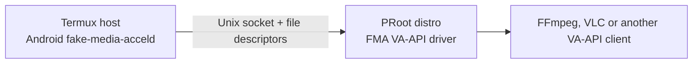

# PRoot setup

FMA has two parts and they must run on opposite sides of the PRoot boundary:



The Android daemon must run in Termux, where it can use MediaCodec. The VA-API
driver and Linux media application run inside the distro. Do not start the
daemon from the PRoot shell.

This is currently a development install. There is no FMA Termux package or
prebuilt release yet.

## 1. Build the Android daemon

On a computer with the Android SDK, NDK, CMake and ADB installed:

```bash
git clone https://github.com/RandomCoderOrg/fake-media-accel.git
cd fake-media-accel

cmake -S . -B build-android \
  -DCMAKE_TOOLCHAIN_FILE="$ANDROID_NDK_HOME/build/cmake/android.toolchain.cmake" \
  -DANDROID_ABI=arm64-v8a \
  -DANDROID_PLATFORM=android-26 \
  -DCMAKE_BUILD_TYPE=Release
cmake --build build-android --parallel --target fake-media-acceld

adb push build-android/fake-media-acceld \
  /sdcard/Download/fake-media-acceld
```

Use the ABI reported by `getprop ro.product.cpu.abi` if the device is not
ARM64. The repository CI also builds `armeabi-v7a` and `x86_64`.

In Termux, grant storage access once and install the daemon:

```bash
pkg install coreutils
termux-setup-storage
install -m 755 "$HOME/storage/downloads/fake-media-acceld" \
  "$PREFIX/bin/fake-media-acceld"
```

## 2. Start the host daemon

Use a pathname socket in Termux's temporary directory. Both setup routes below
map that directory to `/tmp` inside the distro.

```bash
mkdir -p "$PREFIX/var/log" "$PREFIX/var/run"
rm -f "$TMPDIR/fake-media-accel.sock"

nohup fake-media-acceld "$TMPDIR/fake-media-accel.sock" \
  >"$PREFIX/var/log/fake-media-acceld.log" 2>&1 &
echo $! >"$PREFIX/var/run/fake-media-acceld.pid"
```

Confirm that it started:

```bash
cat "$PREFIX/var/log/fake-media-acceld.log"
```

The expected line is:

```text
fake-media-acceld listening on /data/data/com.termux/files/usr/tmp/fake-media-accel.sock
```

FMA itself does not require a display. The `vainfo` and graphical application
checks later in this guide use an X11 VA display, so start Termux:X11 when those
checks are needed:

```bash
termux-x11 :0 >"$PREFIX/var/log/termux-x11.log" 2>&1 &
```

To stop it later:

```bash
kill "$(cat "$PREFIX/var/run/fake-media-acceld.pid")"
rm -f "$TMPDIR/fake-media-accel.sock"
```

## 3A. Enter a proot-distro container

Install a distro if needed:

```bash
pkg install proot-distro
proot-distro install ubuntu
```

The shared temporary directory is required for the FMA socket and a graphical
session. If `/dev/dma_heap/system` is readable in Termux, bind the DMA heaps as
well:

```bash
proot-distro login ubuntu --shared-tmp --bind /dev/dma_heap:/dev/dma_heap
```

If the DMA heap does not exist or Termux cannot read it, omit the bind:

```bash
proot-distro login ubuntu --shared-tmp
```

The driver will then use its CPU-mappable fallback. Decode still works, but VA
surface export to EGL or another DRM PRIME consumer will not.

## 3B. Enter a uDroid Bash CLI distro

Use the installed suite name shown by `udroid --list`, for example:

```bash
udroid login jammy:raw
```

The uDroid Bash CLI shares Termux's temporary directory and binds `/dev` by
default. Do not use `--no-shared-tmp` or `--isolated` for an FMA session. Check
the two resources after login:

```bash
test -S /tmp/fake-media-accel.sock && echo "FMA socket is visible"
test -r /dev/dma_heap/system && echo "DMA heap is usable"
```

If the second check fails, the driver automatically falls back to ordinary
CPU-mappable surfaces.

## 4. Build the VA-API driver inside the distro

These commands are for Ubuntu or Debian:

```bash
apt update
apt install -y build-essential cmake pkg-config git \
  libva-dev libva-x11-2 libdrm-dev vainfo ffmpeg

mkdir -p "$HOME/src"
git clone https://github.com/RandomCoderOrg/fake-media-accel.git \
  "$HOME/src/fake-media-accel"
cd "$HOME/src/fake-media-accel"

cmake -S . -B build-proot \
  -DCMAKE_BUILD_TYPE=Release \
  -DCMAKE_INSTALL_PREFIX="$HOME/.local" \
  -DCMAKE_INSTALL_LIBDIR=lib
cmake --build build-proot --parallel --target fma-va-driver fma-info
cmake --install build-proot
```

Package equivalents for other common guests:

```bash
# Arch Linux
pacman -S --needed base-devel cmake pkgconf git libva libdrm libva-utils ffmpeg

# Alpine Linux
apk add build-base cmake pkgconf git libva-dev libdrm-dev libva-utils ffmpeg
```

Then build with the same CMake commands.

## 5. Configure and verify the guest

Set the X display used by Termux:X11. Change `:0` if the server uses another
display number.

```bash
export DISPLAY=:0
export FMA_SOCKET=/tmp/fake-media-accel.sock
export LIBVA_DRIVER_NAME=fma
export LIBVA_DRIVERS_PATH="$HOME/.local/lib/dri"
```

First test the cross-PRoot connection without libva:

```bash
"$HOME/src/fake-media-accel/build-proot/fma-info" "$FMA_SOCKET"
```

It should print the protocol version and the codecs reported by Android. Then
check that libva loads the FMA driver:

```bash
vainfo --display x11
```

The driver exposes H.264 constrained-baseline/main/high, VP9 Profile 0 and AV1
Profile 0 VLD when Android reports matching MediaCodec decoders. AV1 requires
the packet-preserving FFmpeg patch documented in
[`patches/ffmpeg`](../patches/ffmpeg/README.md); an unpatched FFmpeg can use the
H.264 and VP9 paths but cannot supply FMA's complete AV1 packet contract.

For a correctness check against FFmpeg's software decoder, use a local H.264
video:

```bash
cd "$HOME/src/fake-media-accel"
tools/fma-va-verify.sh /path/to/h264-video.mp4
```

Success ends with `decoded output matches`. A normal application can then be
launched with the same environment. For example, after installing VLC:

```bash
apt install -y vlc
vlc --avcodec-hw=vaapi /path/to/h264-video.mp4
```

With a patched FFmpeg build, compare AV1 hardware output against the distro's
software decoder before testing a larger application:

```bash
tools/fma-va-av1-verify.sh /path/to/sample.ivf \
  /path/to/patched-ffmpeg /usr/bin/ffmpeg
```

After verification, put the four environment exports in the desktop session's
startup file so applications inherit them.

## Troubleshooting

- `connect: No such file or directory`: the daemon is not running or the
  distro was entered without a shared Termux `/tmp`.
- `vainfo` cannot open the display: start Termux:X11 and use its actual
  `DISPLAY` number.
- `vaInitialize failed`: check `LIBVA_DRIVER_NAME`, `LIBVA_DRIVERS_PATH` and
  confirm that the directory contains `fma_drv_video.so`.
- No `/dev/dma_heap/system`: decoding can use the fallback. Set
  `FMA_VA_DMA_HEAP=none` explicitly when testing that route.
- The daemon disappears after Termux is backgrounded: exempt Termux from
  Android battery optimization or keep the Termux session in the foreground.
- For short protocol traces, set `FMA_VA_DEBUG=1`. Do not leave it enabled for
  normal playback.

Related projects: [proot-distro](https://github.com/termux/proot-distro),
[Termux:X11](https://github.com/termux/termux-x11) and the
[uDroid Bash CLI](https://github.com/RandomCoderOrg/fs-manager-udroid).
