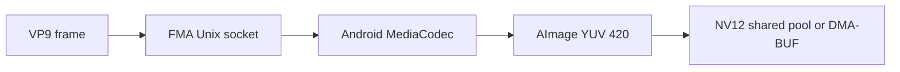
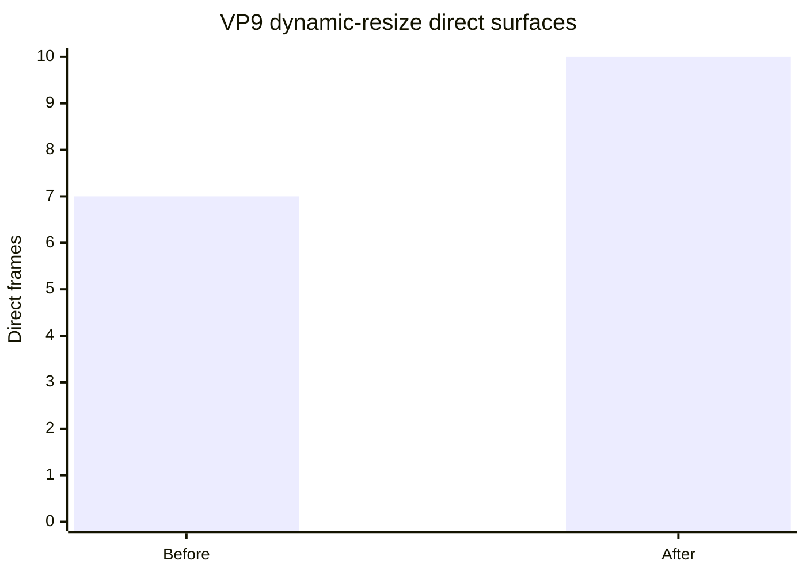

# VP9 decode checkpoint

FMA accepts VP9 Profile 0 frames from IVF or VA-API and passes the original
compressed frame bytes to Android MediaCodec. Decoded 8-bit 4:2:0 frames are
returned as NV12 through the shared frame pool or a registered DMA-BUF output
surface.



## Completion contract

The VP9 codec checkpoint covers:

- Profile 0, 8-bit, 4:2:0 decode;
- IVF framing and timestamp conversion;
- quantizer extremes, resizing, show-existing-frame and intra-only behavior;
- superframes, segmentation and 1080p tiling;
- explicit rejection when a compressed frame exceeds one MediaCodec input
  buffer, avoiding partial output or silent frame loss;
- drain, flush and repeated decode cycles;
- exact visible-frame agreement with FFmpeg software decode;
- output-format changes with visible crop metadata;
- bounded input and output waits, with no decoded frames sent over a network
  socket.

The checksum-pinned smoke corpus is derived from FFmpeg's
[VP9 FATE definitions](https://github.com/FFmpeg/FFmpeg/blob/master/tests/fate/vpx.mak)
and can be prepared with:

```sh
tools/fma-vp9-fate-smoke.sh build/fma-ivf-inspect build/vp9-fate-smoke
```

| Sample class | IVF packets | Decoded frames | Pixel decode rate |
| --- | ---: | ---: | ---: |
| Quantizer extremes | 2 | 2 | 51 fps |
| Dynamic resize | 10 | 10 | 303 fps |
| Show existing frame | 13 | 13 | 433 fps |
| Intra-only | 7 | 7 | 287 fps |
| Superframe and segmentation | 25 | 25 | 710 fps |
| 1080p tiling | 2 | 2 | 82 fps |

The rates are decode-throughput measurements, not presentation FPS. A separate
synthetic 320x180, 60-frame stream decoded at 552 fps.

## Pixel validation

Quantizer, show-existing-frame, intra-only, superframe/segmentation and 1080p
tiling output matched FFmpeg's visible NV12 output byte for byte. The dynamic
resize sample changes from 352x288 to 282x173 for frames 4 through 6 and then
back to 352x288. MediaCodec keeps a 352x288 allocation and changes its crop
rectangle. FMA now reports that visible size with each frame rather than
mistaking the padded allocation for scaled video.

The initial verifier used `width * height * 3/2`, which is only valid when both
dimensions are even and omitted the last chroma row at 282x173. FMA now uses
`width * height + 2 * ceil(width/2) * ceil(height/2)` throughout its visible
output and VA image paths. All ten resize frames, including all three odd-height
frames, now match FFmpeg software decode byte for byte.

FFmpeg recreates its VA context and surfaces at both size transitions while
FMA deliberately retains the larger stateful MediaCodec session. Initially the
three 282x173 surfaces used their smaller 320x176 allocation and could not be
registered as direct outputs for the retained 384x288 decoder pool. FMA now
realigns a newly used VA surface to the active decoder pool in `vaBeginPicture`.
Visible dimensions remain 282x173, but MediaCodec can write directly into every
surface.

| Dynamic-resize measurement | Before realignment | After realignment |
| --- | ---: | ---: |
| Exact frames | 10/10 | 10/10 |
| Direct surfaces | 7/10 | 10/10 |
| Driver surface-store copy | 0.209 MiB | 0 MiB |
| Surface-reallocation cost | n/a | 3.271 ms total |



This result was reproduced through the real uDroid supervisor and app SELinux
domain on a Pixel 6a. The 147,804-byte quantizer vector also remained exact and
direct for both frames, and a 50-frame Gravity H.264 run remained 50/50 exact
and direct after the shared allocation change. No decoded frame bytes crossed
the Unix socket in these probes. MediaCodec still copies `AImage` output into
the registered DMA-BUF; eliminating that Android-side copy is a separate
AHardwareBuffer checkpoint.

A forced 16 KiB MediaCodec input limit correctly rejects the 147,804-byte,
two-packet quantizer sample before submitting an incomplete VP9 frame. Android's
VP9 decoder does not accept MediaCodec partial-frame input reliably; the normal
component buffer is large enough for the conformance corpus, while an oversized
frame now fails explicitly instead of silently producing one of two frames.

Three consecutive decode/flush cycles of the show-existing sample produced 39
of 39 frames, and all three output cycles had the same MD5:

```text
950623aecd12f04541c7b6155d53d591
950623aecd12f04541c7b6155d53d591
950623aecd12f04541c7b6155d53d591
```

No decoded frame bytes crossed the socket in these probes. The socket carries
control messages and compressed packets; decoded output lives in the shared
pool or registered DMA-BUF.

## VA-API boundary

The driver advertises `VAProfileVP9Profile0` with `VAEntrypointVLD`. Unlike the
H.264 VA path, it does not reconstruct codec headers: libva supplies the full
VP9 frame in `VASliceDataBufferType`, so FMA validates the Profile 0 picture
contract and forwards the selected slice bytes unchanged. Slice offsets and
ALL/BEGIN/MIDDLE/END fragmentation are bounds checked.

This behavior follows the
[libva VP9 decode contract](https://github.com/intel/libva/blob/master/va/va_dec_vp9.h)
and FFmpeg's
[VA-API VP9 adapter](https://github.com/FFmpeg/FFmpeg/blob/master/libavcodec/vaapi_vp9.c).
The public driver test verifies profile discovery, rejection of Profile 2,
slice offset handling, exact packet forwarding, surface synchronization and
cleanup.

Profile 2 and other 10-bit output remain outside this checkpoint because FMA's
current public decoded-frame contract is NV12.
