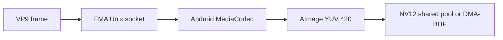

# VP9 decode checkpoint

FMA accepts VP9 Profile 0 frames from IVF or VA-API and passes the original
compressed frame bytes to Android MediaCodec. Decoded 8-bit 4:2:0 frames are
returned as NV12 through the shared frame pool or a registered DMA-BUF output
surface.



## Completion contract

The VP9 codec checkpoint covers:

- Profile 0, 8-bit, 4:2:0 decode;
- IVF framing and timestamp conversion;
- quantizer extremes, resizing, show-existing-frame and intra-only behavior;
- superframes, segmentation and 1080p tiling;
- compressed frames larger than one MediaCodec input buffer;
- drain, flush and repeated decode cycles;
- exact visible-frame agreement with FFmpeg software decode;
- output-format changes with visible crop metadata;
- bounded input and output waits, with no decoded frames sent over a network
  socket.

The checksum-pinned smoke corpus is derived from FFmpeg's
[VP9 FATE definitions](https://github.com/FFmpeg/FFmpeg/blob/master/tests/fate/vpx.mak)
and can be prepared with:

```sh
tools/fma-vp9-fate-smoke.sh build/fma-ivf-inspect build/vp9-fate-smoke
```

| Sample class | IVF packets | Decoded frames | Pixel decode rate |
| --- | ---: | ---: | ---: |
| Quantizer extremes | 2 | 2 | 51 fps |
| Dynamic resize | 10 | 10 | 303 fps |
| Show existing frame | 13 | 13 | 433 fps |
| Intra-only | 7 | 7 | 287 fps |
| Superframe and segmentation | 25 | 25 | 710 fps |
| 1080p tiling | 2 | 2 | 82 fps |

The rates are decode-throughput measurements, not presentation FPS. A separate
synthetic 320x180, 60-frame stream decoded at 552 fps.

## Pixel validation

Quantizer, show-existing-frame, intra-only, superframe/segmentation and 1080p
tiling output matched FFmpeg's visible NV12 output byte for byte. The dynamic
resize sample changes from 352x288 to 282x173 for frames 4 through 6 and then
back to 352x288. MediaCodec keeps a 352x288 allocation and changes its crop
rectangle. FMA now reports that visible size with each frame rather than
mistaking the padded allocation for scaled video.

For the three resized frames, luma matched exactly. Chroma differs only at the
padding boundary created by the odd 173-line visible height; the aggregate
comparison is 53.32 dB PSNR. This is a layout-boundary difference, not a scaled
or corrupted decode.

A forced 16 KiB MediaCodec input limit split a 147,804-byte, two-packet sample
across three input buffers and retained its reference MD5. Three consecutive
decode/flush cycles of the show-existing sample produced 39 of 39 frames, and
all three output cycles had the same MD5:

```text
950623aecd12f04541c7b6155d53d591
950623aecd12f04541c7b6155d53d591
950623aecd12f04541c7b6155d53d591
```

No decoded frame bytes crossed the socket in these probes. The socket carries
control messages and compressed packets; decoded output lives in the shared
pool or registered DMA-BUF.

## VA-API boundary

The driver advertises `VAProfileVP9Profile0` with `VAEntrypointVLD`. Unlike the
H.264 VA path, it does not reconstruct codec headers: libva supplies the full
VP9 frame in `VASliceDataBufferType`, so FMA validates the Profile 0 picture
contract and forwards the selected slice bytes unchanged. Slice offsets and
ALL/BEGIN/MIDDLE/END fragmentation are bounds checked.

This behavior follows the
[libva VP9 decode contract](https://github.com/intel/libva/blob/master/va/va_dec_vp9.h)
and FFmpeg's
[VA-API VP9 adapter](https://github.com/FFmpeg/FFmpeg/blob/master/libavcodec/vaapi_vp9.c).
The public driver test verifies profile discovery, rejection of Profile 2,
slice offset handling, exact packet forwarding, surface synchronization and
cleanup.

Profile 2 and other 10-bit output remain outside this checkpoint because FMA's
current public decoded-frame contract is NV12.
